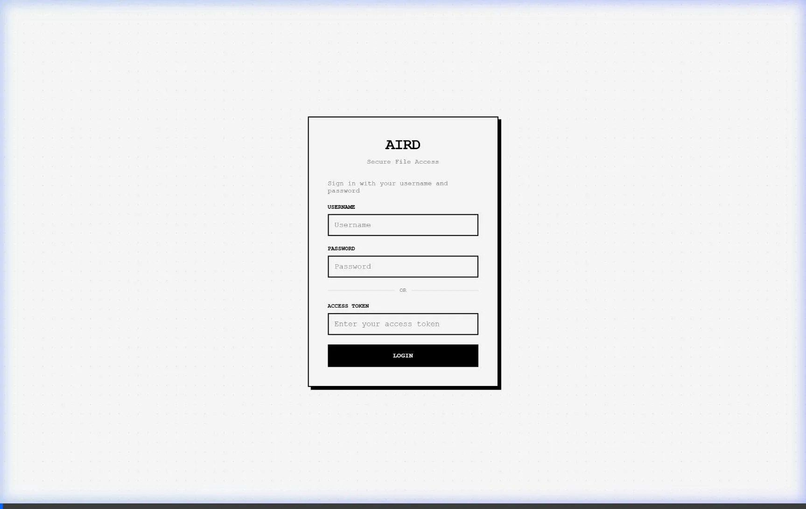

# Aird - Modern Web-Based File Management Platform



🚀 **A lightweight, fast, and secure web-based file browser, editor, and sharing platform built with Python and Tornado.**

Aird provides a comprehensive file management solution with real-time streaming, in-browser editing, advanced search capabilities, and secure file sharing through a clean and intuitive web interface. Perfect for development teams, system administrators, and anyone who needs efficient file management.

## ✨ Key Features

### 📁 **File Management**
- **Browse & Navigate** - Intuitive file browser with resizable columns and mobile-responsive design
- **In-Browser Editing** - Full-featured editor with syntax highlighting, line numbers, and auto-save
- **Large File Support** - Memory-efficient handling of large files with streaming capabilities
- **File Type Recognition** - Smart file type detection with appropriate icons and handling

### 🔍 **Super Search**
- **Content-Based Search** - Find text patterns across your entire directory structure
- **Advanced Pattern Matching** - Support for regular expressions and complex search queries
- **Real-Time Results** - Live search with WebSocket updates as you type
- **Context Display** - See matching lines with surrounding context for better understanding
- **Interactive Navigation** - Click any result to jump directly to the file and line
- **Performance Optimized** - Memory-mapped operations for fast searching in large codebases

### 📡 **File Streaming**
- **Real-Time Log Monitoring** - Perfect for following log files and monitoring system output
- **WebSocket-Based Streaming** - Live updates without page refreshes
- **Configurable Controls** - Set number of lines to display, play/stop controls
- **Filter Support** - Advanced filtering with AND/OR logic and regex patterns
- **Memory Efficient** - Stream line-by-line without loading entire files into memory

### 🔐 **Secure File Sharing**
- **Token-Based Security** - Generate secure, randomly generated tokens for share access control
- **Public/Private Shares** - Choose between token-protected or public access for shares
- **Dynamic vs Static Shares** - Live folder sharing or snapshot-based sharing
- **Advanced Filtering** - Use glob patterns to include/exclude specific files
- **Share Management** - Create, update, and revoke shares with real-time updates
- **Session Persistence** - Tokens stored in cookies and Authorization headers for seamless access

### ☁️ **Cloud Storage Integration**
- **Multi-Cloud Support** - Seamlessly link your Google Drive and Microsoft OneDrive accounts directly into Aird
- **Unified Interface** - Browse, view, and manage your cloud files using the familiar Aird file manager UI
- **Chunked Uploads** - Support for large file uploads with resumable, chunked uploads out-of-the-box
- **Direct Downloads** - Proxy and stream downloads directly from cloud storage to your browser

### ⚡ **Peer-to-Peer (P2P) Transfers**
- **WebRTC Integration** - Direct browser-to-browser file transfers without storing files temporarily on the server
- **Secure Anonymous Rooms** - Create shareable transfer rooms for external guests or known users
- **Real-Time WebSockets** - Instant signaling and room management
- **Privacy First** - Files are sent directly between clients, improving speed and security

### 🖥️ **Network File Sharing (SMB & WebDAV)**
- **Embedded SMB Server** - Run your own native SMB (Server Message Block) server so you can mount Aird folders directly in Windows File Explorer or macOS Finder.
- **Embedded WebDAV Server** - Run a fully-featured WebDAV server with locking support to map network drives over HTTP.
- **Dynamic Provisioning** - Start and stop shares on the fly, directly from the Aird administrator dashboard without restarting the app.
- **Access Control** - Protect your native network shares with custom usernames, passwords, and optional strictly read-only modes.

### 🔌 **API-First Architecture**
- **RESTful API** - Complete REST API for all file operations and management
- **WebSocket Support** - Real-time communication for streaming and live updates
- **Extensible Design** - Build custom applications and integrations on top of Aird
- **JSON Responses** - Clean, consistent API responses for easy integration
- **Authentication Support** - Token-based and LDAP authentication for secure API access

### ⚙️ **Administration & Security**
- **Multi-User Environments** - Enable isolated private home folders and storage quota limits per user.
- **Feature Flags** - Granular control over file operations (upload, delete, rename, edit, download, share)
- **User Management** - Database-based user authentication with role-based access control
- **LDAP Integration** - Enterprise-grade authentication with Active Directory support
- **Real-Time Configuration** - Changes apply instantly without server restart
- **Security Headers** - CSRF protection, XSS prevention, and path traversal protection
- **Input Validation** - Comprehensive input sanitization and length validation

## 🚀 Quick Start

### Installation

```bash
# Install from PyPI
pip install aird

# Or install from source
git clone https://github.com/blinkerbit/aird.git
cd aird
pip install -e .
```

### Basic Usage

```bash
# Start with default settings
aird

# Custom port and root directory
aird --port 8080 --root /path/to/files

# With authentication token
aird --token your-secure-token

# Enable LDAP authentication
aird --ldap --ldap-server ldap://your-server.com

# Enable Multi-User Mode with isolated home folders
aird --multi-user
```

### Docker Usage

You can run Aird inside a Docker container and share a folder from your host operating system using a volume mount.

```bash
# Build the Docker image
docker build -t aird-app .

# Run and share a specific directory (e.g., /path/to/files)
docker run -v "/path/to/files:/shared" -p 8000:8000 aird-app python -m aird --root /shared

# Run and share your current directory (PowerShell/Linux/macOS)
docker run -v "$PWD:/shared" -p 8000:8000 aird-app python -m aird --root /shared

# Run and share your current directory (Windows Command Prompt)
docker run -v "%cd%:/shared" -p 8000:8000 aird-app python -m aird --root /shared
```

### Configuration

Create a `config.json` file for advanced configuration:

```json
{
  "port": 8080,
  "root_dir": "/path/to/files",
  "access_token": "your-secure-token",
  "admin_token": "admin-secure-token",
  "ldap": {
    "enabled": true,
    "server": "ldap://your-server.com",
    "base_dn": "dc=example,dc=com"
  },
  "feature_flags": {
    "file_upload": true,
    "file_delete": true,
    "file_share": true,
    "super_search": true
  }
}
```

## 🔌 API Usage

Aird provides a comprehensive REST API for all operations:

### File Operations
```bash
# List files in a directory
GET /api/files/path/to/directory

# Upload a file
POST /upload
Content-Type: multipart/form-data

# Download a file
GET /files/path/to/file?download=1

# Edit a file
POST /edit/path/to/file
Content-Type: application/json
{"content": "new file content"}

# Delete a file
POST /delete
Content-Type: application/json
{"path": "path/to/file"}
```

### Search Operations
```bash
# Search for text patterns
GET /search?q=search+term&path=/directory

# WebSocket search (real-time)
WebSocket: /search/ws
```

### Share Management
```bash
# Create a share
POST /share/create
Content-Type: application/json
{
  "paths": ["/path/to/file1", "/path/to/file2"],
  "share_type": "static",
  "expiry_date": "2024-12-31T23:59:59"
}

# List active shares
GET /share/list

# Update a share
POST /share/update
Content-Type: application/json
{
  "share_id": "share-id",
  "share_type": "dynamic",
  "allow_list": ["*.txt", "*.log"]
}
```

### WebSocket Streaming
```javascript
// Connect to file streaming
const ws = new WebSocket('ws://localhost:8080/stream/path/to/logfile.log');

ws.onmessage = function(event) {
    const data = JSON.parse(event.data);
    console.log('New line:', data.line);
};
```

## 🛠️ Building Custom Applications

Aird's API-first design makes it perfect for building custom applications:

### Example: Custom File Manager
```python
import requests

class AirdClient:
    def __init__(self, base_url, token):
        self.base_url = base_url
        self.headers = {'Authorization': f'Bearer {token}'}
    
    def list_files(self, path):
        response = requests.get(f'{self.base_url}/api/files/{path}', headers=self.headers)
        return response.json()
    
    def search_files(self, query, path='/'):
        response = requests.get(f'{self.base_url}/search', 
                              params={'q': query, 'path': path}, 
                              headers=self.headers)
        return response.json()
    
    def create_share(self, paths, share_type='static'):
        data = {'paths': paths, 'share_type': share_type}
        response = requests.post(f'{self.base_url}/share/create', 
                               json=data, headers=self.headers)
        return response.json()

# Usage
client = AirdClient('http://localhost:8080', 'your-token')
files = client.list_files('/documents')
results = client.search_files('error', '/logs')
```

### Example: Log Monitoring Dashboard
```javascript
// Real-time log monitoring
const logStream = new WebSocket('ws://localhost:8080/stream/var/log/app.log');

logStream.onmessage = function(event) {
    const data = JSON.parse(event.data);
    addLogEntry(data.line, data.timestamp);
};

function addLogEntry(line, timestamp) {
    const logContainer = document.getElementById('logs');
    const entry = document.createElement('div');
    entry.className = 'log-entry';
    entry.innerHTML = `<span class="timestamp">${timestamp}</span> ${line}`;
    logContainer.insertBefore(entry, logContainer.firstChild);
}
```

## 🔧 Advanced Features

### Memory-Mapped File Operations
- Efficient handling of large files (>1MB) using memory mapping
- Falls back to traditional I/O for smaller files to avoid overhead
- Used for file streaming, content search, and large file viewing

### WebSocket Connection Management
- Configurable connection limits and idle timeouts
- Automatic cleanup of dead/idle connections
- Real-time statistics and monitoring

### Filter Expression System
- Complex AND/OR logic with parentheses
- Quoted terms, escaped expressions, and regex patterns
- Used across file streaming and search functionality

### Database Integration
- SQLite-backed persistence for feature flags and settings
- User management with secure password hashing
- Share management with automatic schema migrations

## 📱 Mobile & Accessibility

- **Mobile-Responsive Design** - Optimized for smartphones and tablets
- **Touch-Friendly Controls** - Easy navigation on touch devices
- **Keyboard Shortcuts** - Efficient navigation and operations
- **Screen Reader Support** - Proper accessibility features
- **Progressive Web App Ready** - Can be installed as a web app

## 🔒 Security Features

- **Path Traversal Protection** - Built-in security measures to prevent unauthorized access
- **Input Validation** - Comprehensive input sanitization and length validation
- **Secure Session Management** - HTTP-only cookies with CSRF protection
- **Token-Based Authentication** - Secure access with customizable tokens
- **LDAP/Active Directory Integration** - Enterprise-grade authentication
- **Content Security Policy** - XSS prevention and security headers

## 🎯 Use Cases

### Development Teams
- **Code Review** - Share code snippets and files with team members
- **Log Monitoring** - Real-time monitoring of application logs
- **File Collaboration** - Edit and share files in real-time
- **Search Codebase** - Find patterns across entire codebases

### System Administrators
- **Server File Management** - Browse and manage server files remotely
- **Log Analysis** - Stream and analyze system logs
- **Configuration Management** - Edit configuration files safely
- **Backup Monitoring** - Monitor backup files and logs

### Content Creators
- **File Organization** - Organize and manage large file collections
- **Content Sharing** - Share files with clients and collaborators
- **Version Control** - Track file changes and versions
- **Search Content** - Find specific content across files

## 📊 Performance

- **Memory Efficient** - Handles large files without loading them entirely into memory
- **Fast Search** - Memory-mapped operations for quick content searching
- **Concurrent Users** - Supports multiple users with WebSocket connection pooling
- **Scalable** - Built on Tornado's async architecture for high performance

## 🤝 Contributing

We welcome contributions! Please see our [Contributing Guidelines](CONTRIBUTING.md) for details.

### Development Setup

```bash
# Clone the repository
git clone https://github.com/blinkerbit/aird.git
cd aird

# Install in development mode
pip install -e .

# Run tests
python -m pytest tests/

# Start development server
python -m aird --debug
```

## 📄 License

This project is licensed under the **Business Source License 1.1 (BSL)** - see the [LICENSE](LICENSE) file for complete details.

### License Summary:
- ✅ **Free for most uses** - Use, modify, and distribute freely for personal, educational, and internal business purposes.
- ✅ **Eventually Open Source** - Code converts to the **Apache 2.0 License** 10 years after release.
- ⚠️ **Commercial restriction** - You may not use Aird to provide a commercial "File-Management-as-a-Service" offering without a commercial enterprise license.
- 🚫 **No AI Training** - You may not use the source code or documentation to train, fine-tune, or improve any AI or machine learning models.

For commercial service licensing, please contact **Viswantha Srinivas P**.

## 🔗 Links

- **GitHub Repository:** [https://github.com/blinkerbit/aird](https://github.com/blinkerbit/aird)
- **PyPI Package:** [https://pypi.org/project/aird/](https://pypi.org/project/aird/)
- **Documentation:** [https://github.com/blinkerbit/aird/wiki](https://github.com/blinkerbit/aird/wiki)
- **Issue Tracker:** [https://github.com/blinkerbit/aird/issues](https://github.com/blinkerbit/aird/issues)

---

**Made with ❤️ by Viswantha Srinivas P**

*Star ⭐ this repo if you find it useful!*